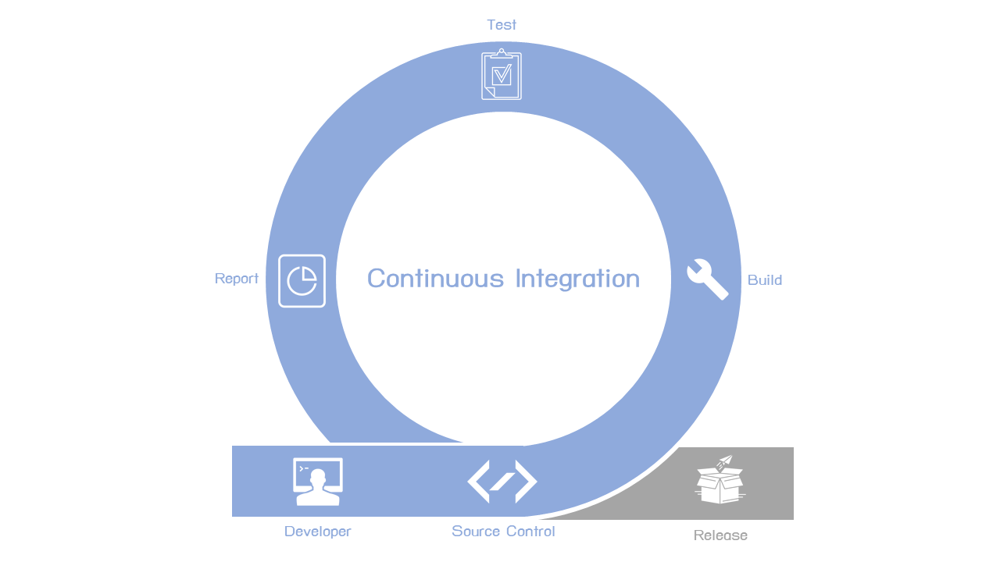

# CI/CD with Laravel




### CI หรือ Continuous Integration
เป็นกระบวนการอย่างหนึ่ง ในการรวบรวมซอฟแวร์ที่อาจเกิดจากนักพัฒนาหนึ่งหรือหลายคนเข้าด้วยกันเป็นหนึ่งเดียว

> * CD จะมีความหมายอยู่สองแบบคือ Continuous Delivery และ Continuous Deployment*


### Continuous Deployment 
เป็นกระบวนการอย่างหนึ่ง ในการเปิดตัวซอฟต์แวร์ โดยการส่งมอบซอฟต์แวร์ทุกขั้นตอนจนถึงการ Deployment ขึ้น Production จะทำในรูปแบบอัตโนมัติทั้งหมด (ขึ้น Production ทันที)


### Continuous Delivery 
เป็นกระบวนการอย่างหนึ่ง ในการเปิดตัวซอฟต์แวร์ คล้ายกับ Continuous Deployment เพียงแต่ตอนส่งมอบซอฟต์แวร์ขึ้น Production จะต้องมีการได้รับอนุมัติหรือการอนุญาตจากผู้ที่มีสิทธิ์ตัดสินใจเปิดตัวซอฟต์แวร์ ซึ่งรูปแบบนี้เป็นแบบ Manual (ต้องมีการอนุญาติก่อนขึ้น Production)

> ในส่วนของการเลือกว่า CD เป็นจะแบบ Continuous Delivery หรือ Continuous Deployment ขึ้นอยู่กับข้อกำหนดตกลงหรือกระบวนการวิธีทำงานของแต่ละที่

### Pipeline
ในแต่ละขั้นตอนการพัฒนาที่เชื่อมเข้าด้วยกันจนเกิดวงจรการพัฒนาขึ้นจะเรียกภาพรวมของสิ่งที่เกิดขึ้นในกระบวนการเหล่านี่ว่า Pipeline (เปรียบเสมือนท่อที่ค่อยเชื่อมต่อการพัฒนาแต่ละขั้นเข้าด้วยกันหรือที่เรียกว่าเส้นทางในการทำงาน)

------


## Docker compose
- docker-compose.yml สร้าง build container port 3000
- docker-compose.development.yml สร้าง container ชื่อ laravel-docker-development
- docker-compose.production.yml คือเราจะสั่งให้สร้าง container ชื่อ laravel-docker-production

### สั่งรัน development
```
docker-compose -f docker-compose.yml -f docker-compose.development.yml up
```
### สั่งรัน production
```
docker-compose -f docker-compose.yml -f docker-compose.production.yml up
```

### หรือสร้าง shell script เพื่อ run ได้ง่ายขึ้น เช่น development.sh

```
docker-compose -f docker-compose.yml -f docker-compose.development.yml up
```

---

## Resources

- [https://armno.in.th](https://armno.in.th/2018/08/16/blog-automated-deployment/)
- [https://www.jittagornp.me](https://www.jittagornp.me/blog/lets-make-your-blog/)
- [https://ima8.me/](https://ima8.me/2018/06/424/make-your-own-ci-cd-pipelines-%E0%B9%83%E0%B8%84%E0%B8%A3%E0%B9%86-%E0%B8%81%E0%B9%87%E0%B8%97%E0%B8%B3-ci-cd-%E0%B8%82%E0%B8%AD%E0%B8%87%E0%B8%95%E0%B8%B1%E0%B8%A7%E0%B9%80%E0%B8%AD%E0%B8%87/)
- [https://articles.devsight.me/](https://articles.devsight.me/ci-cd-%E0%B9%83%E0%B8%99%E0%B8%81%E0%B8%B2%E0%B8%A3%E0%B8%97%E0%B8%B3-auto-deploy-code-frontend-vue-js-react-angular-ea69d4d5ab78)
- [https://www.atlassian.com/](https://www.atlassian.com/continuous-delivery/principles/continuous-integration-vs-delivery-vs-deployment)
